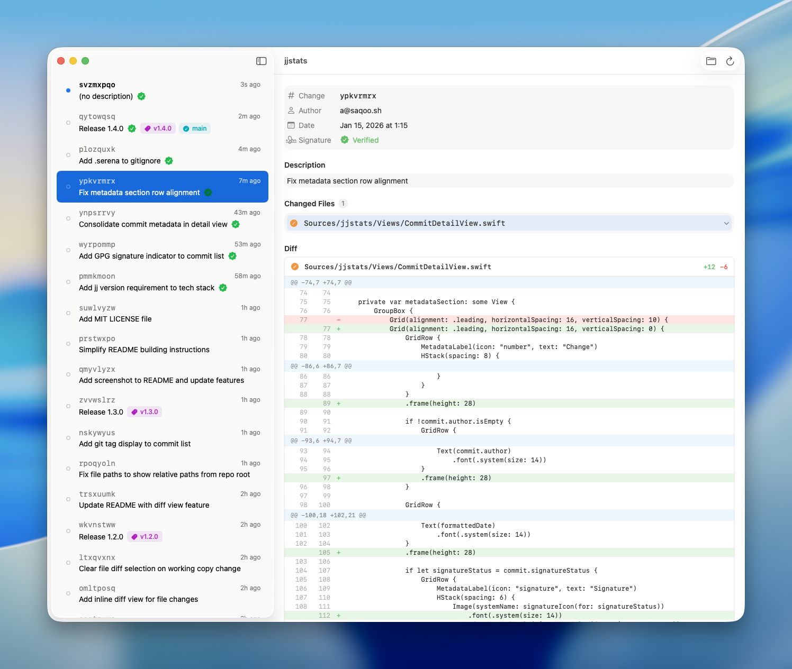

# jjstats

A simple macOS app to view [jj (Jujutsu)](https://github.com/martinvonz/jj) repository history.



## Features

- View commit history in a clean sidebar
- See changed files for each commit
- **Inline diff view** - Click on a file to see line-by-line changes (GitHub-style)
- Git tag display in commit list
- Auto-refresh when repository changes (via FSEvents)
- Native macOS app built with SwiftUI

## Requirements

- macOS 14.0+
- jj installed at `/opt/homebrew/bin/jj`

## Building

### Using xcodegen (recommended)

```bash
xcodegen generate
xcodebuild -project jjstats.xcodeproj -scheme jjstats -configuration Debug build
```

### Using Swift Package Manager

```bash
swift build
swift run
```

Note: Running via SPM will not show a Dock icon. Use xcodebuild for a proper app bundle.

## Usage

1. Launch the app
2. Click "Open Repository..." or use Cmd+O
3. Select a folder containing a jj repository (has `.jj` directory)
4. Browse commit history and view changed files
5. Click on a file to view its diff (click again to collapse)

## Project Structure

```
Sources/jjstats/
├── jjstatsApp.swift          # App entry point
├── Models/
│   ├── Commit.swift          # Commit model
│   ├── FileChange.swift      # File change model
│   ├── FileDiff.swift        # Diff model (hunks, lines, stats)
│   └── JJRepository.swift    # Repository state (@Observable)
├── Services/
│   ├── JJCommandRunner.swift # jj CLI wrapper + diff parser
│   └── FileWatcher.swift     # FSEvents wrapper
└── Views/
    ├── ContentView.swift     # Main view with folder picker
    ├── CommitListView.swift  # Sidebar commit list
    ├── CommitRow.swift       # Single commit row
    ├── CommitDetailView.swift # Detail view
    ├── FileChangeRow.swift   # File change row
    └── FileDiffView.swift    # Inline diff view
```

## License

MIT
